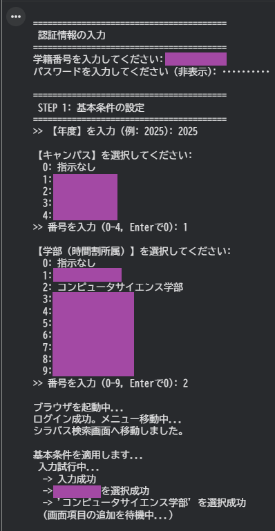
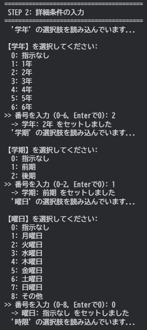
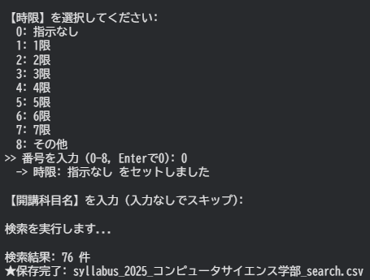
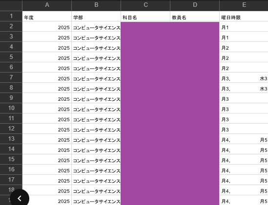

# university-syllabus-scraper 


## プライバシーとツールの限界 (Scope & Limitation)

### 個人情報保護への配慮
コードには大学のURLやログイン情報は一切ハードコーディングしていません。実行時にURLを入力させることで、**特定の大学が特定されないようプライバシーに配慮しています。**

### 実用上の限界と汎用性
本ツールは、特定の大学ポータルシステム（Campus Square等）のHTML構造に合わせて設計・最適化されています。

**このため、別の大学サイトで使用する場合、以下の手順が必要です：**
1.  **対象サイトのHTML構造をデバッグツールで理解する。**
2.  **シラバスサイトのリンク＋コード内の関数（要素IDやXPath）を、新しいサイトの構造に合わせて書き換える。**

⚠️このコードは、汎用的な実用性よりも、**「複雑なWebシステムに対する堅牢な自動化と、ユーザー中心のUI設計」**を目的としているため、要素IDなどを書き換えれば実行できますが、実行向けではありません。

---

## プロジェクトの概要 (Mission)

大学の履修登録システムは情報が散在しており、新入生にとって大きなストレス源となっています。
本ツールは、複雑なWeb操作を排除し、**「対話形式」で誰でも直感的に必要な授業データを取得・リスト化**できるPythonアプリケーションです。

単なる自動化ではなく、「ユーザーが迷わないインターフェース」と「止まらない堅牢性」にこだわり、学生の体験価値（UX）向上を目指しました。

---

## 実行デモ (Demo)
ターミナル上の質問に答えるだけで、システムが裏側で複雑な操作を代行します。

### STEP 1: 基本条件の入力
認証情報や、検索したい年度・キャンパスを対話形式で指定します。


### STEP 2: 動的項目の選択
学部を選択すると、Webサイト側の更新（Ajax）を検知し、最新の「学年」や「学期」の選択肢を自動で読み込んで提示します。


### STEP 3: 実行と保存
条件に合致するデータを抽出し、整形されたCSVファイルとして保存します。


### 成果物 (Output)
非構造なWebデータを、分析可能なクリーンなデータとして出力します。

*(※ プライバシー保護のため、教員名等はマスキングしています)*

---

## 技術的なこだわり (Technical Highlights)
オリエンタルランドが重視する **SCSE (Safety, Courtesy, Show, Efficiency)** の行動指針を、システム設計の思想に取り入れました。

### Safety (堅牢性・安全性)
* **Stale Element対策:** Webスクレイピングで頻発する「画面更新による要素消失エラー」に対し、要素の再取得と自動リトライロジック（最大5回）を実装。通信環境に左右されず、止まらずに完走する堅牢な設計です。
* **セキュリティ:** `getpass` モジュールを使用し、パスワード入力時の覗き見防止対策を実装しています。

### Courtesy (使いやすさ・UX)
* **対話型インターフェース:** プログラミング知識がない学生でも使えるよう、CLI（コマンドライン）での親切な対話形式を採用しました。
* **動的DOM検知:** 「学部を選択すると、画面が書き換わる」という挙動を自動検知して待機。システム都合の読み込み遅延による、ユーザーのストレスを排除しました。

### Efficiency (効率化)
* **ピンポイント収集:** 全データを無差別に取るのではなく、必要な年度・キャンパス・学部を指定して収集することで、サーバー負荷を最小限に抑えつつ、作業時間を手動の数十分の一に短縮しました。

---

## 機能一覧 (Features)
* **スマートログイン:** ログインURLやIDを対話形式で受け付け（コードへのハードコーディング排除）。
* **動的フォーム対応:** 学部選択によるページリロードやDOM更新を自動待機。
* **データクレンジング:** 取得した非構造化データをPandasで整理し、分析可能なCSVとして保存。
* **エラーハンドリング:** 予期せぬポップアップや読み込み遅延に対する防御策。

## 使い方 (Usage)

1.  **リポジトリのクローン**
    ```bash
    git clone [https://github.com/](https://github.com/)ryujp1/university-syllabus-scraper.git
    cd university-syllabus-scraper
    ```

2.  **依存ライブラリのインストール**
    ```bash
    pip install -r requirements.txt
    ```

3.  **実行**
    ```bash
    python scraper.py
    ```
    画面の指示に従って、URLや検索条件を入力してください。

---
## ⚠️ 実行環境の制約 (Prerequisites)
本ツールはSeleniumを使用するため、Python環境の他に、**Google Chrome または Chromium ブラウザ本体**が実行環境にインストールされている必要があります。

## 今後の展望 (Future Roadmap)
収集したデータ（Data Foundation）を基盤として、以下の「体験価値向上」機能の実装を進めています。

1.  **Campus Congestion Forecast (キャンパス混雑予報):**
    * 授業データから人の流れをシミュレーションし、学食やバスの混雑を予測・可視化する。
2.  **Personalized Course Recommender (履修版 Disney Genie):**
    * 「金曜日は全休したい」「移動距離を減らしたい」等の個人のニーズに合わせ、最適な時間割プランを自動生成するコンシェルジュ機能。

---
*Created by [ryujp1]*